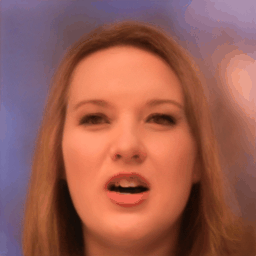

## In-Domain GAN

- IdInvert : In-Domain GAN Inversion for Real Image Editing (ECCV 2020) : [arxiv](https://arxiv.org/abs/2004.00049), [review](https://happy-jihye.github.io/gan/gan-23/)
- reference : [`bryandlee/stylegan2-encoder-pytorch`](https://github.com/bryandlee/stylegan2-encoder-pytorch)

**Results**
| original | Domain-Guided Encoder | + Cartoon-StyleGAN |
| --- | --- | --- |
|  |  |  |