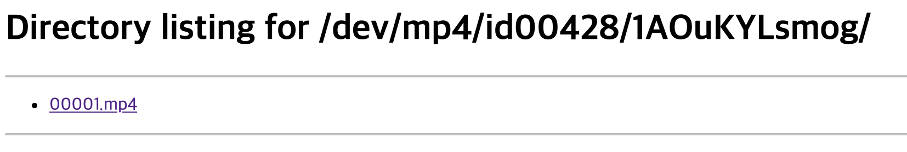
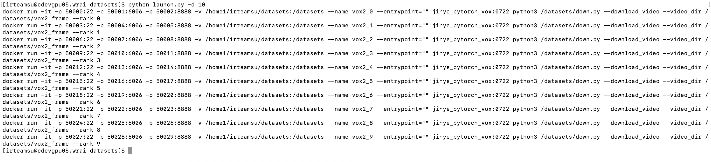
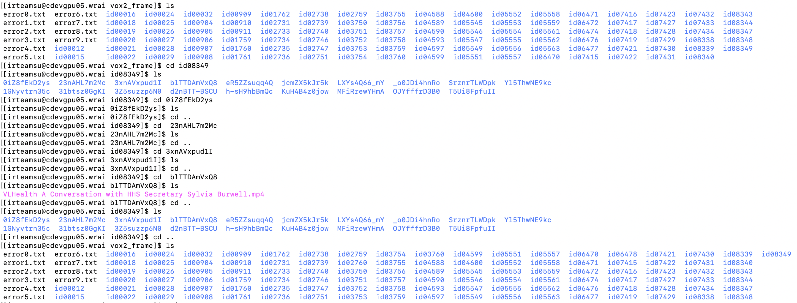
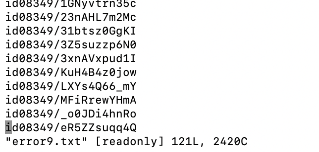
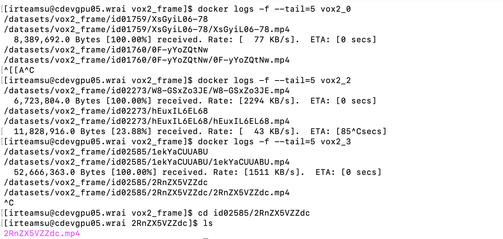

# VoxCeleb2

## VoxCeleb2 Dataset Download 

- [Vox2 page link](https://www.robots.ox.ac.uk/~vgg/data/voxceleb/vox2.html)


1. **Download files**
   - Create bash_file (`download.sh`) and Download dataset at once
  
   - `bash download.sh`

    - ```bash
        #!/bin/bash

        wget https://thor.robots.ox.ac.uk/~vgg/data/voxceleb/vox1a/vox2_dev_mp4_partaa
        wget https://thor.robots.ox.ac.uk/~vgg/data/voxceleb/vox1a/vox2_dev_mp4_partab
        wget https://thor.robots.ox.ac.uk/~vgg/data/voxceleb/vox1a/vox2_dev_mp4_partac
        wget https://thor.robots.ox.ac.uk/~vgg/data/voxceleb/vox1a/vox2_dev_mp4_partad
        wget https://thor.robots.ox.ac.uk/~vgg/data/voxceleb/vox1a/vox2_dev_mp4_partae
        wget https://thor.robots.ox.ac.uk/~vgg/data/voxceleb/vox1a/vox2_dev_mp4_partaf
        wget https://thor.robots.ox.ac.uk/~vgg/data/voxceleb/vox1a/vox2_dev_mp4_partag
        wget https://thor.robots.ox.ac.uk/~vgg/data/voxceleb/vox1a/vox2_dev_mp4_partah
        wget https://thor.robots.ox.ac.uk/~vgg/data/voxceleb/vox1a/vox2_dev_mp4_partai

        ```

2. **Make zip file / Unzip**
    - make zip_file : `cat vox2_dev_mp4* > vox2_mp4.zip`
    - unzip : `unzip vox2_mp4.zip`
    - If `unzip` is not working, install `far` or `fastjar` 
      - `jar xfv vox2_mp4.zip`
      - `fastjar xfv vox2_mp4.zip`
  
3. **video**
   `python3 -m http.server [port]`
   <p align='center'></p>
   <p align='center'></p>


---

## Download Youtube Videos and Extract Frames

**Usage**
- not to use multiple dockers
    - `pip install opencv-python, pytube, pafy, youtube_dl ...`
    ```bash
    usage: vox2_data.py [-h] [--download_video] [--video_to_frame]
                        [--frame_by_txt] [--video_dir VIDEO_DIR]
                        [--id_path ID_PATH] [--id ID [ID ...]]
                        [--id_file ID_FILE [ID_FILE ...]] [--pytube PYTUBE]
                        [--rank RANK]

    Download Youtube Video

    optional arguments:
    -h, --help            show this help message and exit
    --download_video      1. Download all youtube video in id
    --video_to_frame      2. Extract Frame Images from all Videos
    --frame_by_txt        3. Extract Specific Frame Images by Text File
    --video_dir VIDEO_DIR
                            directory to store video
    --id_path ID_PATH     id (ex. Vox2/txt)
    --id ID [ID ...]      id (ex. id10001 id10002 id10003)
    --id_file ID_FILE [ID_FILE ...]
                            id and file (ex. id10001/kienfi2kd id10002/ekwifjd
                            id10003/eiwkfod)
    --pytube PYTUBE       download youtube video by pytube
    --rank RANK
    ```
    ```
    # 1. Download all videos : --download_video
    # ex) python3 vox2_data.py --id=id00428  --video_dir=video_txt --download_video

    python3 vox2_data.py --id=[id]  --video_dir=[dir] --download_video

    # 2. Extract Frame Images from all Videos : --frame_by_txt
    # ex) python3 vox2_data.py --id=id00428  --video_dir=video_txt --download_video --video_to_frame
    python3 vox2_data.py --id=[id]  --video_dir=[dir] --video_to_frame

    # 3. Extract Specific Frame Images by Text File : --frame_by_txt
    # ex) python3 vox2_data.py --id=id00428  --video_dir=video_txt --download_video --frame_by_txt
    python3 vox2_data.py --id=[id]  --video_dir=[dir] --frame_by_txt
    ```

- to use multiple dockers
  ```bash
    usage: launch.py [-h] [-p PATH] [-d DOCKER_NUM]
                    [--error_txt_dir ERROR_TXT_DIR] [--port PORT]

    Download youtube videos

    optional arguments:
    -h, --help            show this help message and exit
    -p PATH, --path PATH  directory path of voxceleb txt file
    -d DOCKER_NUM, --docker_num DOCKER_NUM
                            If you want to set up multiple dockers and download
                            data fastly, put docker_num.
    --error_txt_dir ERROR_TXT_DIR
                            Directory containing the error txt file that was
                            created when the python file was first run
    --port PORT
  ```
    <p align='center'></p>

  ```
  # 1. Download data through the voxceleb folder path
  python launch.py -p vox2_txt -d 10
  ```
  <p align='center'></p>
  <p align='center'></p>


  ```
  # 2. Download data by error message

  python launch.py -d 10
  ```

  <p align='center'></p>
